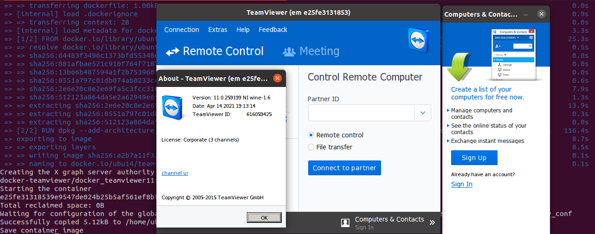

docker-teamviewer
=================

[TeamViewer](https://github.com/bbinet/docker-teamviewer): the TeamViewer
docker container.

Build
-----
The project consists of two files: docker-teamviewer11 and the Dockerfile.
The docker-teamviewer11 file is a shellscript that prepares the environment to start and configure the container.
To avoid that, when starting Teamviewer, it does not ask to accept the license, shscrt creates a directory called teamv_cont to place the global.conf extracted from the container after the license is accepted. Therefore, the license only needs to be accepted once. In addition to the license issue, it also prepares the graph server authority cookie.
Schscrt also saves the container image in the teamv_cont directory, if you don't want to save the image, delete the last three lines of schscrt (docker-teamviewer11)

To run the shell script outside the directory:

`bash docker-teamviewer/docker_teamviewer11`

Or inside on project directory:

`bash docker_teamviewer11`

To create the own image `your signature/teamviewer`, execute the following command in the
`docker-teamviewer` folder:

    docker build -t your signature/teamviewer11 . 

You can now push the new image to the public registry:
    
    docker push your signature/teamviewer11

Run
---

To start the container you can use the alias ():

    $ dock_teamv

Then, when starting your teamviewer container, you will want to share the X11
socket file as a volume so that the TeamViewer windows can be displayed on your
Xorg server. You may also need to run command `xhost +` on the host.

    docker pull... only if you sent it to the registry
    $ docker pull your signature/teamviewer11

    Run container manually (the var $Cookiefile need be configured, see the docker-teamviewer11 source for details)
    $ docker run -it -d --name teamviewer --env XAUTHORITY=/cookie \
    -v $Cookiefile:/cookie --env DISPLAY=$DISPLAY \ 
    -v /tmp/.X11-unix/X0:/tmp/.X11-unix/X0 --ipc=host ubu14/teamviewer

Example of container run

